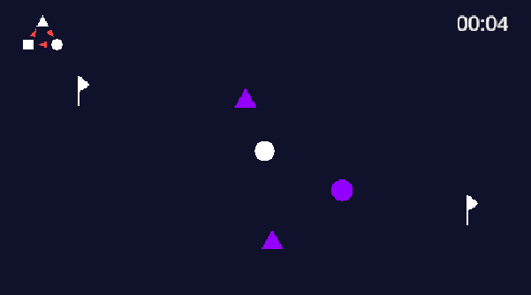

ゲーム制作技術総合実習 個人ワーク
（Circle, Triangle, Squareを使用した2Dゲーム）

# RunPon

## ゲームの内容
追いかけてくる敵を倒しながらゴールを目指す！
プレイヤーは白い"丸、三角、四角"を操作して、たくさんある偽のゴールの中から本物のゴールを探し、たどり着ければゲームクリア。（一度訪れたゴールは黄色に表示される）
敵には弱点の形があるため、その形態に変化して衝突することで敵を倒せる。
四角には三角、三角には丸、丸には四角が強い。（　■　＜　▲　＜　●　＜　■　）

## 操作説明
移動：　←　↑　↓　→　キー
形態変更：　spaceキー
弱点説明の表示非表示：　shiftキー